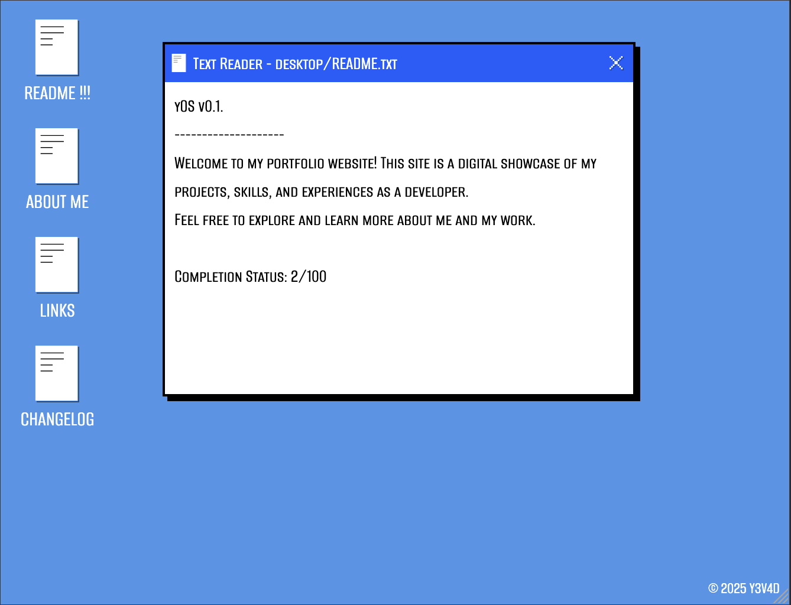
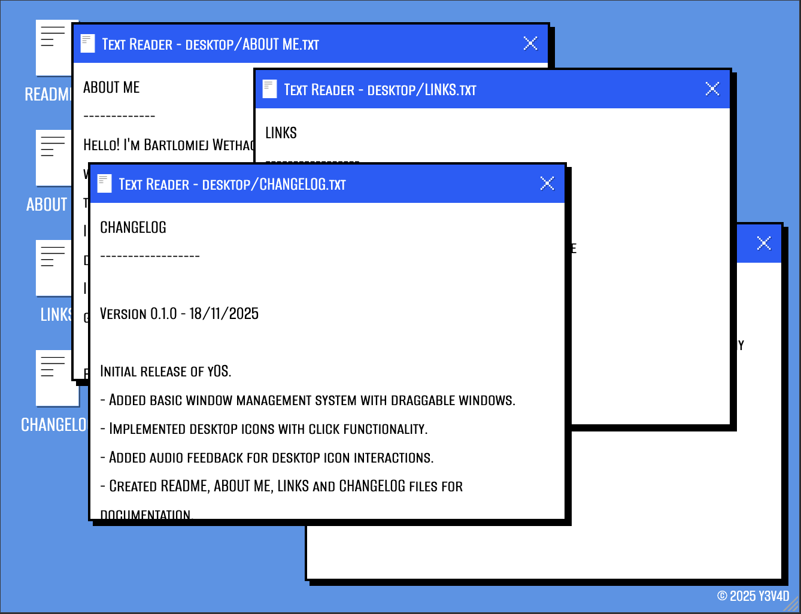
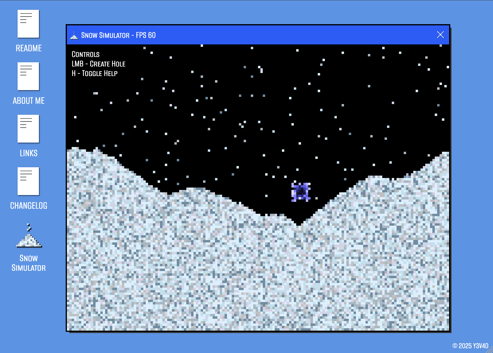

# yOS - A portfolio website showcasing my projects, skills, and experiences as a developer.

## Overview

yOS is a personal portfolio website designed to highlight my work as a developer. It features a unique desktop-like interface, allowing visitors to explore my projects, skills, and experiences in an engaging way.
The website is built using Svelte and Tailwind CSS, ensuring a responsive and visually appealing design.

*Project is still a very early work in progress (WIP) and many features are yet to be implemented.*

## Features (WIP)

- Desktop-like interface with draggable windows
- Interactive icons representing different projects and skills
- Portfolio applications showcased as interactive windows emiulating a desktop environment (WIP)
- Responsive design for optimal viewing on various devices (WIP)
- Easy navigation through different sections of the portfolio (WIP)

## Technologies Used

- SvelteKit
- Tailwind CSS
- TypeScript
- Vite

## Live Demo

A live demo of yOS can be found at: [https://y3v4d.com](https://y3v4d.com)

## Image Gallery

