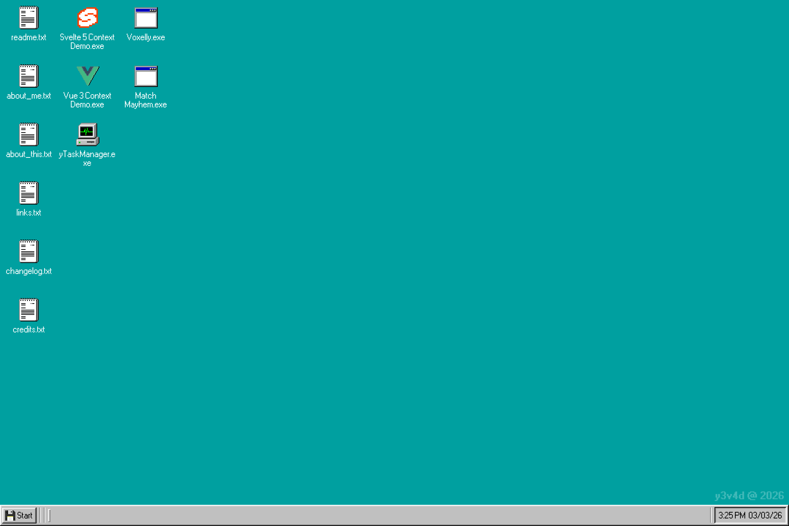
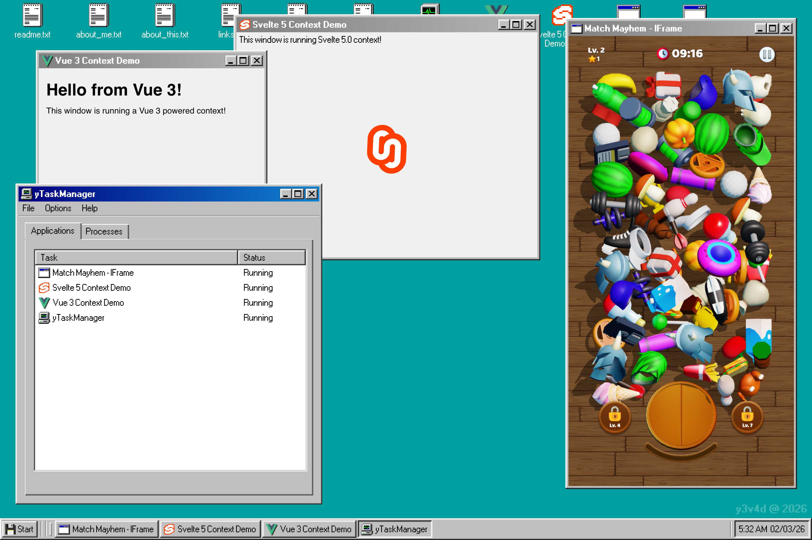
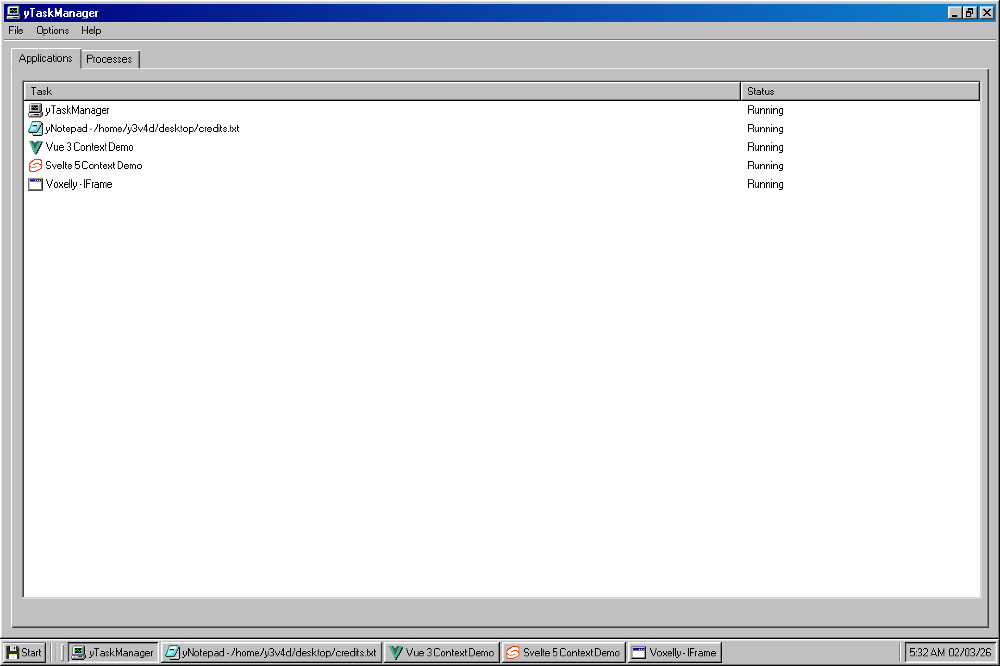
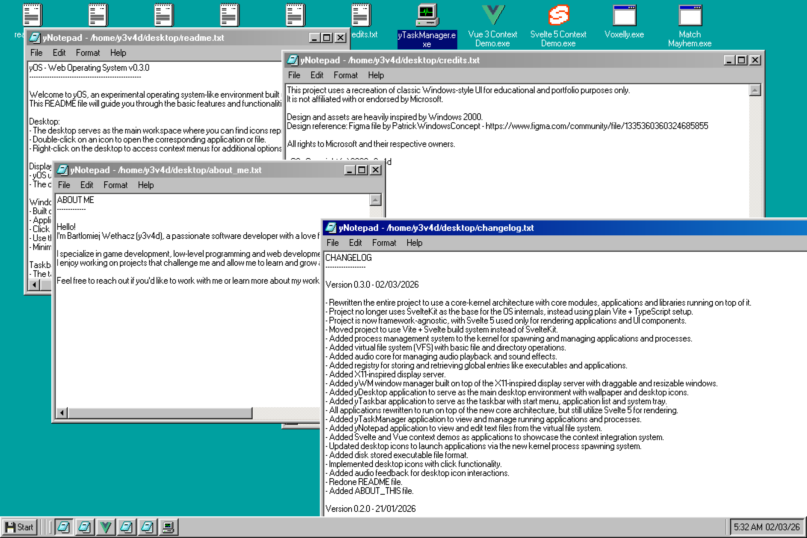

# yOS - A Unix-like operating system running in the browser.

## Overview
yOS started as a portfolio website with a Windows 2000-inspired desktop UI, and evolved into a genuinely Unix-like and framework-agnostic operating system running entirely in the browser. The system is built around a lean kernel that manages processes, IPC, and a virtual filesystem — with all higher-level functionality like the display server and window manager implemented as separate userspace applications communicating over kernel primitives, trying to mirror how a real Unix system is structured.

## Architecture
The kernel is intentionally minimal, exposing low-level primitives that userspace applications build on top of:

- **Process management** — applications are compiled to IIFE bundles, stored on the VFS as executable files, and launched by the kernel using the Function constructor. Each process receives a proxied `kernel` object that tracks the calling process for all kernel calls and allows the kernel to manage resources and permissions on a per-process basis.
- **Shared libraries** - since applications are built with Vite and bundled as IIFEs, they can treat any dependencies as external (e.g. `svelte` or `vue`) to reduce their file size, if those dependencies already exist in the system in form of libraries. Using Vite, those external dependencies need to be associated with synchronous global variables (like `svelte` namespace which can map to `include('svelte').core`), which is exactly what the `include` global function does - it uses asynchronously loaded libraries before the application code runs, but exposes them as synchronous globals, allowing apps to use them without worrying about the asynchronous nature of the VFS.
- **Unix domain sockets** — the kernel implements `socket`, `bind`, `listen`, `accept`, `connect`, `send` and `readv`, mirroring their Linux equivalents. All interprocess communication is built on top of these primitives.
- **Virtual filesystem** — an inode and block based VFS backed by IndexedDB for persistence across page loads. Supports file descriptors, `open`,  `mkdir`, `rmdir`, `unlink`, `read`, `write`, `lseek`, `fseek`, `opendir`, `readdir` and standard path resolution.
- **Dynamic library loading** — `dlopen` allows processes to asynchronously load libraries from the VFS at runtime, mirroring the Unix `dlopen` function.

## Display System
The display system is split into two parts mirroring X11:

- **Y11 server** — a userspace application that manages connected clients, window state, input events and the DOM. Clients communicate with it exclusively over kernel sockets.
- **Y11 client library** — a library that implements a subset of the X11 protocol, exposing functions like `openDisplay`, `createWindow`, `mapWindow`, `attachContext`, `nextEvent` and more. The window manager should use SubstructureRedirect to intercept map requests before they are processed by the server, exactly as a real X11 window manager does.

## Window Manager
yWM is a fully featured window manager implemented as a userspace application on top of Y11:

- SubstructureRedirect and MapRequest handling
- Window decorations and reparenting
- Focus management
- Move, resize, maximise and minimise
- Active window tracking
- Stacking order management

## Applications
All applications are compiled separately, stored on the VFS and loaded on demand:

- **yDesktop** — desktop environment with icon grid, drag and drop positioning and shortcut file support
- **yTaskbar** — taskbar with start menu, application list and system tray
- **yTaskManager** — view and manage running processes
- **yNotepad** — text file viewer and editor
- **yBrowser** — in-app browser for external websites
- **Personal and past client projects** — a collection of my previous work, including games, web applications and more
- **Installer** — downloads and installs all built-in apps and libraries to the VFS on first boot

## Technologies
- **TypeScript**
- **Vite**
- **Svelte 5** - used as a main renderer for yWM decorations and all built-in applications
- **Vue 3** - used only as a proof of concept of the framework-agnostic nature of the system, demonstrating that y11 client library is able to attach contexts of different frameworks naturally side by side without any issues

## Deep dive technical explanation

I wrote a detailed technical article explaining the architecture and implementation of yOS, covering the kernel design, display system, window manager and applications. 

You can read it here: https://dev.to/y3v4d/i-built-a-unix-like-os-running-in-browser-201n

## Live Demo
[https://y3v4d.com](https://y3v4d.com)

## Gallery

